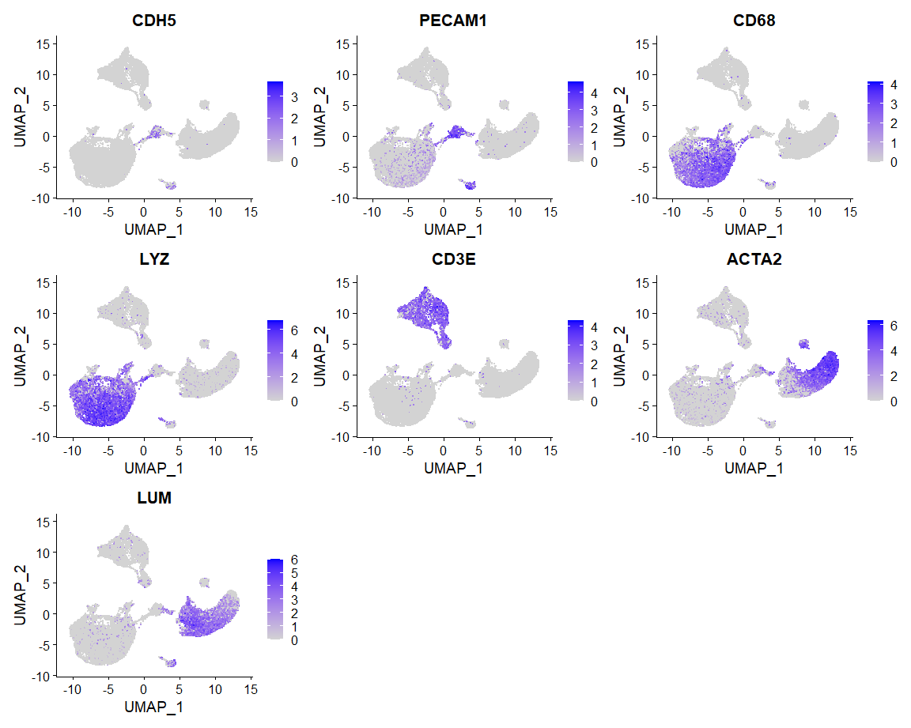
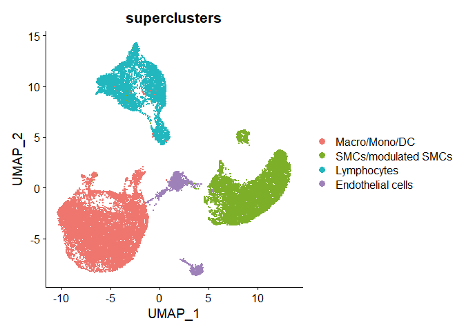
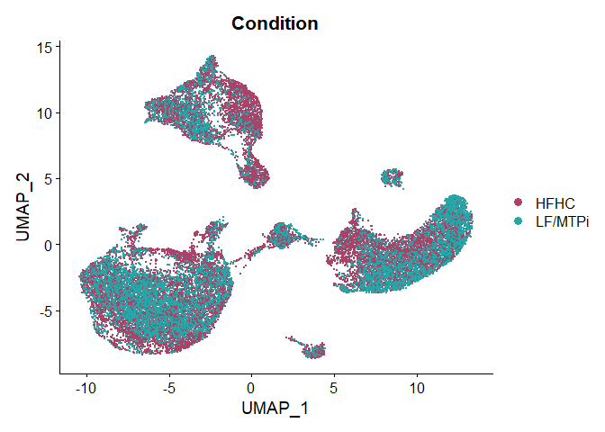
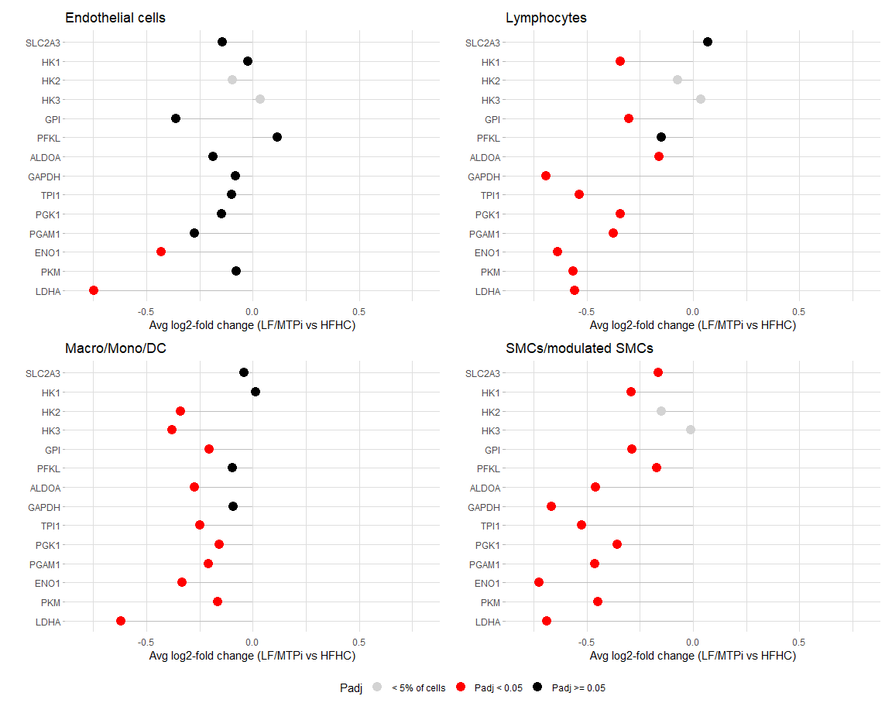
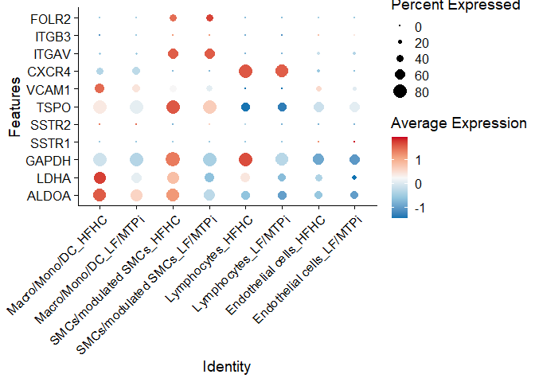

Single Cell of Pig Aorta plaque Samples
================
Paula Nogales, Daniel Morales, Diana Sharysh, Carlos Torroja, Fátima
Sánchez-Cabo, Jacob F. Bentzon

- [1 Abstract](#1-abstract)
- [2 Experiment design](#2-experiment-design)
- [3 Data](#3-data)
- [4 SetUp R environment](#4-setup-r-environment)
- [5 Sample Metadata](#5-sample-metadata)
- [6 Load CellRanger Counts
  Matrices](#6-load-cellranger-counts-matrices)
- [7 Load Genes Metadata](#7-load-genes-metadata)
- [8 Find Doublets](#8-find-doublets)
- [9 QC and Filter Single Cell
  Experiment](#9-qc-and-filter-single-cell-experiment)
- [10 Cluster cells](#10-cluster-cells)
  - [10.1 Remove doublets](#101-remove-doublets)
  - [10.2 Cluster and Dimensionality
    reduction](#102-cluster-and-dimensionality-reduction)
  - [10.3 Find Markers of clusters](#103-find-markers-of-clusters)
  - [10.4 Supercluster Markers Expression
    plots](#104-supercluster-markers-expression-plots)
  - [10.5 Annotate cell types for each
    cluster](#105-annotate-cell-types-for-each-cluster)
  - [10.6 Find Differeantialy Expressed Genes between HFHC and MTPi
    conditions for each cell
    type.](#106-find-differeantialy-expressed-genes-between-hfhc-and-mtpi-conditions-for-each-cell-type)
    - [10.6.1 Gene Expression Changes on core glycolysis
      genes](#1061-gene-expression-changes-on-core-glycolysis-genes)
  - [10.7 DotPlot on gene targets of biological
    tracers](#107-dotplot-on-gene-targets-of-biological-tracers)
- [11 Session Info](#11-session-info)

This code will help to reproduce the clustering and annotation of the
single cell RNA-Seq experiment of Pig Aorta plaque Samples from
PCSK9<sup>D374Y</sup> Pigs under HFD or MTPi treatment, published in:

…

# 1 Abstract

Positron emission tomography (PET) imaging with the radiolabeled glucose
analog fluoro-deoxyglucose (18FDG) is widely used to monitor
atherosclerosis in clinical trials, but the information that 18FDG-PET
imaging provides on plaque biology is uncertain. The longstanding
paradigm that 18FDG is mainly taken up by macrophages is at odds with
human and experimental data, and the impact of disease activity on 18FDG
uptake has not been directly examined. Here, we developed a large-animal
model of plaque regression in proprotein convertase subtilisin kexin
type 9 (PCSK9) transgenic minipigs and analyzed the ability of 18FDG-PET
to monitor disease activity and the underlying mechanism.
Atherosclerosis was induced through 12 months of high-fat feeding, and
disease activity was then lowered for 3 months by reducing plasma
cholesterol levels with a low-fat diet or the combination of a low-fat
diet and microsomal transfer protein inhibition. Regression of plaques
was evident by reduced lipid content, smaller necrotic core size, and
partial resolution of plaque inflammation. Remarkably, the changes were
accompanied by lowering of 18FDG-PET imaging signal to that of
non-atherosclerotic controls. To understand the underlying mechanism, we
produced single-cell gene expression profiles from progressing and
regressing plaques and found that reduction of disease activity was
followed by substantial downregulation of genes encoding glycolysis
enzymes in SMCs, modulated SMCs, macrophages, and lymphocytes. The
combined findings show that 18FDG-PET imaging can monitor disease
activity in atherosclerosis because disease activity is tightly linked
with glycolytic activity of all of the major cell types in
atherosclerotic plaque.

# 2 Experiment design

Single cell gene expression analysis of Aorta plaque derived cells from
11 PCSK<sup>9D374Y</sup> Pig Samples.

6 animals on High Fat Diet (HFHC) from 3 to 15 months to induce
atherosclerosis and 5 of those animals changed to standard diet
supplemented with BMS-212122 (LF/MTPi) for 3 months before single cell
experiment.

Cells have been captured in one lane per sample of the Chromium Next GEM
Chip G (10x Genomics) targeting for 15^4 cells per lane.

Libraries have been prepared using the Chromium Next GEM Single Cell 3’
GEM, Library v3.1 kit from 10x Genomics

Sequenced in the HiSeq 4000 Illumina platform with I1 (10nt), R1 (28nt)
and R2 (90nt).

# 3 Data

To reproduce the analysis of the related paper you will need to download
from the BioStudies reposotory
[E-MTAB-13898](https://www.ebi.ac.uk/biostudies/arrayexpress/studies/E-MTAB-13898)
the following files:

Samples and Genes Metadata: -sampleMetadata.txt.gz
-genesMetadata.v109.feb2023.archive.tsv.gz

CellRanger Quantification Files Per Sample:
-Sample_Aorta_9897_barcodes.tsv.gz -Sample_Aorta_9897_features.tsv.gz
-Sample_Aorta_9897_matrix.mtx.gz -Sample_Aorta_9901_barcodes.tsv.gz
-Sample_Aorta_9901_features.tsv.gz -Sample_Aorta_9901_matrix.mtx.gz
-Sample_Aorta_9909_barcodes.tsv.gz -Sample_Aorta_9909_features.tsv.gz
-Sample_Aorta_9909_matrix.mtx.gz -Sample_Aorta_9911_barcodes.tsv.gz
-Sample_Aorta_9911_features.tsv.gz -Sample_Aorta_9911_matrix.mtx.gz
-Sample_Pig1_Aorta_barcodes.tsv.gz -Sample_Pig1_Aorta_features.tsv.gz
-Sample_Pig1_Aorta_matrix.mtx.gz -Sample_Pig2_Aorta_barcodes.tsv.gz
-Sample_Pig2_Aorta_features.tsv.gz -Sample_Pig2_Aorta_matrix.mtx.gz
-Sample_Pig3_Aorta_barcodes.tsv.gz -Sample_Pig3_Aorta_features.tsv.gz
-Sample_Pig3_Aorta_matrix.mtx.gz -Sample_Pig4_Aorta_barcodes.tsv.gz
-Sample_Pig4_Aorta_features.tsv.gz -Sample_Pig4_Aorta_matrix.mtx.gz
-Sample_Pig5_Aorta_barcodes.tsv.gz -Sample_Pig5_Aorta_features.tsv.gz
-Sample_Pig5_Aorta_matrix.mtx.gz -Sample_Pig6_Aorta_barcodes.tsv.gz
-Sample_Pig6_Aorta_features.tsv.gz -Sample_Pig6_Aorta_matrix.mtx.gz
-Sample_Pig7_Aorta_barcodes.tsv.gz -Sample_Pig7_Aorta_features.tsv.gz
-Sample_Pig7_Aorta_matrix.mtx.gz

Doublets Prediction File: -ConsensusDoubletFinderResults.txt.gz

# 4 SetUp R environment

``` r
library(rstudioapi)
library(tidyverse)
library(Seurat)
library(scater)
library(biomaRt)
library(openxlsx)
library(RColorBrewer)

# Color palete
color.list <- c(brewer.pal(12, "Paired"),brewer.pal(12, "Set3"),brewer.pal(8, "Pastel2"),colorRampPalette(c("grey20","grey70"))(4))
to <- color.list[22]
ss <- color.list[18]
color.list[22] <- ss
color.list[18] <- to

myColors <- c(`Macro/Mono/DC` = "#EE766F",
              `SMCs/modulated SMCs` = "#7DAF29",
              Lymphocytes = "#22B7BE",
              `Endothelial cells` = "#9F81BA",
              HFHC = "#AB4267",
              `LF/MTPi` = "#29A4A7"
)
```

# 5 Sample Metadata

``` r
setwd(dirname(rstudioapi::getActiveDocumentContext()$path))
getwd()
```

    ## [1] "F:/LABS/Bionos/scRNASeq-Aorta-Pig"

``` r
sampleMetadataFile <- "sampleMetadata.txt.gz"
sampleMetada <- read_delim(sampleMetadataFile,delim = "\t")
```

    ## Rows: 11 Columns: 12
    ## -- Column specification --------------------------------------------------------
    ## Delimiter: "\t"
    ## chr (12): Sample, Gender, Condition, id, Genotype, Tissue, Experiment, Strai...
    ## 
    ## i Use `spec()` to retrieve the full column specification for this data.
    ## i Specify the column types or set `show_col_types = FALSE` to quiet this message.

``` r
knitr::kable(sampleMetada,format = "simple")
```

| Sample            | Gender | Condition | id    | Genotype | Tissue | Experiment | Strain | Assay_Type | Instrument | Organism | Platform |
|:------------------|:-------|:----------|:------|:---------|:-------|:-----------|:-------|:-----------|:-----------|:---------|:---------|
| Sample_Pig1_Aorta | Female | HFHC      | S9440 | PCSK9    | Aorta  | E1         | Pig    | 3_UMI      | 10X        | Pig      | ILLUMINA |
| Sample_Pig2_Aorta | Female | LF/MTPi   | S9447 | WT       | Aorta  | E1         | Pig    | 3_UMI      | 10X        | Pig      | ILLUMINA |
| Sample_Pig3_Aorta | Female | HFHC      | S9471 | PCSK9    | Aorta  | E1         | Pig    | 3_UMI      | 10X        | Pig      | ILLUMINA |
| Sample_Pig4_Aorta | Female | LF/MTPi   | S9473 | WT       | Aorta  | E1         | Pig    | 3_UMI      | 10X        | Pig      | ILLUMINA |
| Sample_Pig5_Aorta | Female | HFHC      | S9472 | PCSK9    | Aorta  | E1         | Pig    | 3_UMI      | 10X        | Pig      | ILLUMINA |
| Sample_Pig6_Aorta | Male   | HFHC      | S9443 | PCSK9    | Aorta  | E1         | Pig    | 3_UMI      | 10X        | Pig      | ILLUMINA |
| Sample_Pig7_Aorta | Male   | LF/MTPi   | S9475 | WT       | Aorta  | E1         | Pig    | 3_UMI      | 10X        | Pig      | ILLUMINA |
| Sample_Aorta_9897 | Female | HFHC      | S9897 | PCSK9    | Aorta  | E2         | Pig    | 3_UMI      | 10X        | Pig      | ILLUMINA |
| Sample_Aorta_9901 | Male   | HFHC      | S9901 | PCSK9    | Aorta  | E2         | Pig    | 3_UMI      | 10X        | Pig      | ILLUMINA |
| Sample_Aorta_9909 | Female | LF/MTPi   | S9909 | WT       | Aorta  | E2         | Pig    | 3_UMI      | 10X        | Pig      | ILLUMINA |
| Sample_Aorta_9911 | Female | LF/MTPi   | S9911 | WT       | Aorta  | E2         | Pig    | 3_UMI      | 10X        | Pig      | ILLUMINA |

# 6 Load CellRanger Counts Matrices

FASTQ files for each sample were processed using 10X CellRanger software
(v6.0.0), using Sus scrofa genome reference Ss11.1 (Ensembl gene build
v109). Pseudogenes and small RNAs have been removed from the reference.

``` r
crPathFrom <- "."
crPathTo <- "CellRanger.Quantifications"
sampleMetada$FilteredCellRangerCounts <- file.path(crPathTo,sampleMetada$Sample)
```

``` r
if (!dir.exists(crPathTo)) {
  
  cellRangerFiles <- dir(crPathFrom,ignore.case = T,pattern = "^.+(mtx|barcode|feature).+$")
  
  sampleNames <- unique(sub("_(barcodes|matrix|features).+$","",cellRangerFiles,perl = T))
  
  dir.create(crPathTo,showWarnings = F)
  
  dc <- lapply(file.path(crPathTo,sampleNames),dir.create,showWarnings = F, recursive = T)
  
  dc <- lapply(
    sampleNames,
    function (x, pathFrom,pathTo) {
      sampleFilesFrom <- dir(pathFrom,pattern = x)
      sampleFilesFrom <- sampleFilesFrom[grepl("^.+(mtx|barcode|feature).+$",sampleFilesFrom)]
      sampleFilesTo <- file.path(crPathTo,x,sub(paste0(x,"_"),"",sampleFilesFrom))
      file.copy(
        from = file.path(pathFrom,sampleFilesFrom),
        to = sampleFilesTo,overwrite = T)
    },
    pathFrom=crPathFrom,
    pathTo=crPathTo
  )
}
```

``` r
smList <- lapply(sampleMetada$FilteredCellRangerCounts,Read10X,gene.column=1)

names(smList) <- sampleMetada$Sample

smList <- lapply(names(smList), function (x,myList) {
  l <- myList[[x]]
  colnames(l) <- paste(colnames(l),x,sep=".")
  return(l)
  },
  myList = smList)

names(smList) <- sampleMetada$Sample

rawCounts <- do.call(cbind,smList)
```

# 7 Load Genes Metadata

Genes metadata have been obtained from the corresponding Ensembl BioMart
archive. To add more gene names for those missing we have used human
orthologs provided by ensembl compara with a orthology confidence of 1
or a combined identity over 140% (%pig_id+%human_id).

Low expressed have been annotated to filter them out prior to
clustering.

``` r
genesMetadata <- read_delim("genesMetadata.v109.feb2023.archive.tsv.gz",delim = "\t")
```

    ## Rows: 35670 Columns: 12
    ## -- Column specification --------------------------------------------------------
    ## Delimiter: "\t"
    ## chr (8): external_gene_name, wikigene_name, ensembl_gene_id, gene_biotype, c...
    ## dbl (3): start_position, end_position, gene_strand
    ## lgl (1): isExpressed
    ## 
    ## i Use `spec()` to retrieve the full column specification for this data.
    ## i Specify the column types or set `show_col_types = FALSE` to quiet this message.

``` r
genesMetadata <- genesMetadata %>%
  filter(ensembl_gene_id %in% rownames(rawCounts))

MTGenes <- genesMetadata %>%
  filter(genesMetadata$chromosome_name == "MT")
  
RBGenes <- genesMetadata %>%
  filter(gene_biotype == "rRNA" | grepl("^ribosomal protein",description))

SGenes <- genesMetadata %>%
  filter(external_gene_name %in% cc.genes$s.genes)
  
G2MGenes <- genesMetadata %>%
  filter(external_gene_name %in% cc.genes$g2m.genes)
  
HBBGenes <- genesMetadata %>%
  filter(grepl("hemoglobin",genesMetadata$description))

# Get TCR and IG GeneSet from BioMart
IGGenes <- genesMetadata %>%
    filter(grepl("^IG_",gene_biotype))
TRGenes <- genesMetadata %>%
    filter(grepl("^TR_",gene_biotype))
```

``` r
# In case you want to know how to build the genesMetadata table follow this code
# Get genes metadata from BioMart 109
# mart <- useEnsembl(biomart = 'genes', 
#                    dataset = "sscrofa_gene_ensembl",
#                    version = "109")
# 
# genesMetadata <- getBM(
#   attributes = c("external_gene_name"
#                  ,"wikigene_name"
#                  ,"ensembl_gene_id","gene_biotype"
#                  ,"chromosome_name"
#                  ,"start_position","end_position","strand"
#                  ,"description")
#   ,uniqueRows=T, mart = mart )
# 
# # Remove duplicated ensembl_ids
# genesMetadata <- genesMetadata[!duplicated(genesMetadata$ensembl_gene_id),]
# 
# # Anotate empty gene names with wikigene names or human orthologs or ensembl_ids
# # Increase gene annotations with human orthologs
# genesHumanHomologs <- getBM(
#     attributes = c("external_gene_name",
#                    "ensembl_gene_id",
#                    "hsapiens_homolog_ensembl_gene",
#                    "hsapiens_homolog_associated_gene_name",
#                    "hsapiens_homolog_perc_id",
#                    "hsapiens_homolog_perc_id_r1",
#                    "hsapiens_homolog_goc_score",
#                    "hsapiens_homolog_orthology_confidence"),
#     uniqueRows=T, mart = mart )
# 
# # Get high quality orthologs
# # by combining percentage identity of pig-human pairs > 140
# # or confidence anotation == 1
# genesHumanHomologsHQ <- genesHumanHomologs %>%
#   mutate(globalId = hsapiens_homolog_perc_id+hsapiens_homolog_perc_id_r1) %>%
#   arrange(-globalId) %>%
#   filter(hsapiens_homolog_orthology_confidence == 1 |
#            globalId > 140) %>%
#   group_by(ensembl_gene_id) %>%
#   top_n(1,-globalId) %>%
#   as.data.frame() %>%
#   arrange(-globalId)
# 
# # Add wiki or ortholog gene names or ensembl_id when no pig gene_name is found
# genesMetadata <- genesMetadata %>%
#   mutate(external_gene_name = case_when(
#     !grepl("^$",external_gene_name) ~ external_gene_name,
#     grepl("^$",external_gene_name) & !grepl("^$",wikigene_name) ~ wikigene_name,
#     grepl("^$",external_gene_name) & grepl("^$",wikigene_name) & ensembl_gene_id %in% genesHumanHomologsHQ$ensembl_gene_id ~ genesHumanHomologsHQ[match(ensembl_gene_id,genesHumanHomologsHQ$ensembl_gene_id),"hsapiens_homolog_associated_gene_name"],
#     TRUE ~ ensembl_gene_id
#   )) %>%
#   mutate(external_gene_name = case_when(
#     grepl("^$",external_gene_name) ~ ensembl_gene_id,
#     TRUE ~ external_gene_name)) %>%
#   arrange(ensembl_gene_id)
# 
# genesMetadata$uniq_name <- make.unique(toupper(genesMetadata$external_gene_name))
#   
# genesMetadata <- genesMetadata %>%
#     dplyr::select(uniq_name,external_gene_name,wikigene_name,ensembl_gene_id,everything())
```

# 8 Find Doublets

Several rounds of doublet detection have been applied to remove real
doublets and those coming from high levels of background contamination.

Given the random nature of the classification algorithm we provide the
list of doublets classified during the analysis published in the paper
in order to reproduce clustering and UMAP dimensionality reduction.

``` r
doublets <- read_delim("ConsensusDoubletFinderResults.txt.gz",delim = "\t")
```

    ## Rows: 70726 Columns: 2
    ## -- Column specification --------------------------------------------------------
    ## Delimiter: "\t"
    ## chr (2): cellId, ConsensusDoublets
    ## 
    ## i Use `spec()` to retrieve the full column specification for this data.
    ## i Specify the column types or set `show_col_types = FALSE` to quiet this message.

# 9 QC and Filter Single Cell Experiment

``` r
# Build SingleCellExperiment Object
## Cells Metadata
cellsMetadata <- data.frame(
  cellId = colnames(rawCounts),
  Sample = sub(".+\\.","",colnames(rawCounts))) %>%
  left_join(sampleMetada,by="Sample") %>%
  left_join(doublets, by = c("cellId")) %>%
  as.data.frame()

rownames(cellsMetadata) <- cellsMetadata$cellId

sce <- SingleCellExperiment(assays=list(counts=rawCounts),
                            colData = cellsMetadata,
                            rowData=genesMetadata[match(rownames(rawCounts),
                                                        genesMetadata$ensembl_gene_id),])

## Normalize and QC
sce <- logNormCounts(sce)

sce <- addPerCellQC(
  sce
  ,subsets = c(list(
    MT = MTGenes$ensembl_gene_id
    ,RB = RBGenes$ensembl_gene_id
    ,HBB = HBBGenes$ensembl_gene_id
    ,IG = IGGenes$ensembl_gene_id
    ,TR = TRGenes$ensembl_gene_id
  ))
  ,percent.top = c(50,500)
)

sce <- addPerFeatureQC(
    sce
  )

cf <- as.data.frame(colData(sce)) %>%
  group_by(Sample) %>%
  reframe(Cell_Fraction = total/median(total),
          cellId = cellId) %>%
  dplyr::select(cellId,Cell_Fraction)

colData(sce)$Cell_Fraction <- cf$Cell_Fraction[match(colnames(sce),cf$cellId)]
```

``` r
# Annotate Filter Cells
colData(sce) <- DataFrame(
  as.data.frame(colData(sce)) %>%
    mutate(filter_by_total_counts = sum > 1000 & sum < 30000) %>%
    mutate(filter_by_expr_features = detected > 600) %>%
    mutate(filter_by_MT_features = subsets_MT_percent < 15) %>%
    mutate(filter_by_Top50 = percent.top_50 < 50) %>%
    mutate(filter_by_CF = Cell_Fraction > 0.2) %>%
    mutate(filter_by_HBB_features = subsets_HBB_percent < 0.1) %>%
    mutate(ManualFilter = filter_by_total_counts &
             filter_by_expr_features &
             filter_by_MT_features &
             filter_by_HBB_features &
             filter_by_CF &
             filter_by_Top50)
  )
```

# 10 Cluster cells

``` r
counts <- rawCounts[rowData(sce)$isExpressed,
                     which(sce$ManualFilter)]

rownames(counts) <- genesMetadata[match(rownames(counts),genesMetadata$ensembl_gene_id),"uniq_name"]$uniq_name

seuratSCAll <- CreateSeuratObject(
  counts = counts,
  assay = "RNA",
  project = "Pig Aorta",
  names.delim = "\\.",
  names.field = 2,
  min.cells = 0,
  min.features = 0,
  meta.data = data.frame(colData(sce))[which(sce$ManualFilter),]
)
```

## 10.1 Remove doublets

``` r
seuratSC <- subset(seuratSCAll,ConsensusDoublets == "singlet")
seuratSC
```

    ## An object of class Seurat 
    ## 24226 features across 26807 samples within 1 assay 
    ## Active assay: RNA (24226 features, 0 variable features)

## 10.2 Cluster and Dimensionality reduction

``` r
nvargenes <- 2000
pcas <- seq(15)
ress <- 0.2
clustering <- paste0("RNA_snn_res.",ress)

if (file.exists("SeuratSCAnalysisNoDoubletsCells.rds")) {
  seuratSC <- readRDS("SeuratSCAnalysisNoDoubletsCells.rds")
} else {
  ## Normalize, Scale and Cluster
  seuratSC <- seuratSC %>%
    NormalizeData(
      normalization.method = "LogNormalize",
      scale.factor = 10000,
      verbose = F) %>%
    FindVariableFeatures(
      selection.method = "vst",
      nfeatures = nvargenes,
      verbose = F
    ) %>%
    ScaleData(
      verbose = F
    ) %>%
    RunPCA(
      verbose = F
    ) %>%
    FindNeighbors(
      dims = pcas,
      verbose = F
    ) %>%
    FindClusters(
      resolution = ress,
      verbose = F
    ) %>%
    RunUMAP(
      dims = pcas,
      verbose = F
    )
  levels(seuratSC@meta.data[, clustering] ) <- paste0("C",levels(seuratSC@meta.data[, clustering]))
  
  saveRDS(seuratSC,file = "SeuratSCAnalysisNoDoubletsCells.rds")
  
}
```

    ## Warning: The default method for RunUMAP has changed from calling Python UMAP via reticulate to the R-native UWOT using the cosine metric
    ## To use Python UMAP via reticulate, set umap.method to 'umap-learn' and metric to 'correlation'
    ## This message will be shown once per session

## 10.3 Find Markers of clusters

``` r
## Get Cluster Markers
if (file.exists("ClusterMarkersAllCells.xlsx")) {

  cluster.markers <- read.xlsx("ClusterMarkersAllCells.xlsx")

} else {

  cluster.markers <- seuratSC %>%
    FindAllMarkers(
      assay = "RNA"
      , slot = "data"
      , min.pct = 0.3
      , return.thresh = 0.01
      , test.use = "MAST"
      , only.pos = T
      , verbose = F
    )

  cluster.markers %>%
    write.xlsx(file = "ClusterMarkersAllCells.xlsx")

}
```

    ## 
    ## Done!

    ## Combining coefficients and standard errors

    ## Calculating log-fold changes

    ## Calculating likelihood ratio tests

    ## Refitting on reduced model...

    ## 
    ## Done!
    ## 
    ## Done!

    ## Combining coefficients and standard errors

    ## Calculating log-fold changes

    ## Calculating likelihood ratio tests

    ## Refitting on reduced model...

    ## 
    ## Done!
    ## 
    ## Done!

    ## Combining coefficients and standard errors

    ## Calculating log-fold changes

    ## Calculating likelihood ratio tests

    ## Refitting on reduced model...

    ## 
    ## Done!
    ## 
    ## Done!

    ## Combining coefficients and standard errors

    ## Calculating log-fold changes

    ## Calculating likelihood ratio tests

    ## Refitting on reduced model...

    ## 
    ## Done!
    ## 
    ## Done!

    ## Combining coefficients and standard errors

    ## Calculating log-fold changes

    ## Calculating likelihood ratio tests

    ## Refitting on reduced model...

    ## 
    ## Done!
    ## 
    ## Done!

    ## Combining coefficients and standard errors

    ## Calculating log-fold changes

    ## Calculating likelihood ratio tests

    ## Refitting on reduced model...

    ## 
    ## Done!
    ## 
    ## Done!

    ## Combining coefficients and standard errors

    ## Calculating log-fold changes

    ## Calculating likelihood ratio tests

    ## Refitting on reduced model...

    ## 
    ## Done!
    ## 
    ## Done!

    ## Combining coefficients and standard errors

    ## Calculating log-fold changes

    ## Calculating likelihood ratio tests

    ## Refitting on reduced model...

    ## 
    ## Done!
    ## 
    ## Done!

    ## Combining coefficients and standard errors

    ## Calculating log-fold changes

    ## Calculating likelihood ratio tests

    ## Refitting on reduced model...

    ## 
    ## Done!
    ## 
    ## Done!

    ## Combining coefficients and standard errors

    ## Calculating log-fold changes

    ## Calculating likelihood ratio tests

    ## Refitting on reduced model...

    ## 
    ## Done!
    ## 
    ## Done!

    ## Combining coefficients and standard errors

    ## Calculating log-fold changes

    ## Calculating likelihood ratio tests

    ## Refitting on reduced model...

    ## 
    ## Done!

## 10.4 Supercluster Markers Expression plots

``` r
myGenes <- c("CDH5","PECAM1","CD68","LYZ","CD3E","ACTA2","LUM")
```

``` r
seuratSC %>%
  FeaturePlot(features = myGenes)
```

<!-- -->

## 10.5 Annotate cell types for each cluster

Manual annotation based on cluster markers. Refer to the paper for
information.

``` r
types <-
  c(
    "Macro/Mono/DC",
    "SMCs/modulated SMCs",
    "SMCs/modulated SMCs",
    'Lymphocytes',
    "Macro/Mono/DC",
    'Lymphocytes',
    'Endothelial cells',
    'Lymphocytes',
    "Macro/Mono/DC",
    'Endothelial cells',
    "SMCs/modulated SMCs"
  )
Idents(seuratSC) <- clustering
names(types) <- levels(Idents(seuratSC))
seuratSC <- RenameIdents(seuratSC, types)
types <- Idents(seuratSC)
seuratSC$superclusters <- types
```

``` r
seuratSC %>%
  DimPlot(reduction = "umap",
          group.by = "superclusters",
          cols = myColors[levels(factor(seuratSC$superclusters))])
```

<!-- -->

``` r
seuratSC %>%
  DimPlot(reduction = "umap",
          group.by = "Condition",
          cols = myColors[levels(factor(seuratSC$Condition))])
```

<!-- -->

## 10.6 Find Differeantialy Expressed Genes between HFHC and MTPi conditions for each cell type.

``` r
Idents(seuratSC) <- "superclusters"
outputFile <- "AortaMTPiVsHFHC.xlsx"

if (file.exists(outputFile)) {
  
  sheet_names = getSheetNames(outputFile)
  deGenesList = lapply(
    sheet_names,
    function(x,file){
      read.xlsx(file, sheet=x)
      },
    file = outputFile)
  names(deGenesList) <- sheet_names

} else {
  
  deGenesList <- lapply(
    levels(Idents(seuratSC)),
    function (x,sc) {
      FindMarkers(subset(sc,idents = x),
                  ident.1 = "LF/MTPi",
                  ident.2 = "HFHC",
                  group.by = "Condition",
                  assay = "RNA",
                  slot = "data",
                  test.use = "MAST",
                  min.pct = 0.05,
                  logfc.threshold = 0,
                  base = 2,
                  verbose = F
      ) %>%
        mutate(gene = rownames(.)) %>%
        dplyr::select(gene,everything())
    },
    sc = seuratSC)
  
  names(deGenesList) <- levels(Idents(seuratSC))
  write.xlsx(deGenesList,
             file = outputFile)
  
}
```

    ## 
    ## Done!

    ## Combining coefficients and standard errors

    ## Calculating log-fold changes

    ## Calculating likelihood ratio tests

    ## Refitting on reduced model...

    ## 
    ## Done!
    ## 
    ## Done!

    ## Combining coefficients and standard errors

    ## Calculating log-fold changes

    ## Calculating likelihood ratio tests

    ## Refitting on reduced model...

    ## 
    ## Done!
    ## 
    ## Done!

    ## Combining coefficients and standard errors

    ## Calculating log-fold changes

    ## Calculating likelihood ratio tests

    ## Refitting on reduced model...

    ## 
    ## Done!
    ## 
    ## Done!

    ## Combining coefficients and standard errors

    ## Calculating log-fold changes

    ## Calculating likelihood ratio tests

    ## Refitting on reduced model...

    ## 
    ## Done!

### 10.6.1 Gene Expression Changes on core glycolysis genes

``` r
myGenes <- c("SLC2A3","HK1","HK2","HK3","GPI","PFKL","ALDOA","GAPDH","TPI1","PGK1","PGAM1","ENO1","PKM","LDHA")
```

``` r
selectedDEGenes <- lapply(
  names(deGenesList),
  function (x, sc, deList, selgenes) {
    FoldChange(
      subset(sc,idents = x),
      ident.1 = "LF/MTPi",
      ident.2 = "HFHC",
      group.by = "Condition",
      assay = "RNA",
      slot = "data",
      features = selgenes) %>%
      as.data.frame() %>%
      mutate(gene = rownames(.)) %>%
      dplyr::rename(log2FC = "avg_log2FC") %>%
      dplyr::select(gene,everything()) %>%
      left_join(deList[[x]], by = c("gene")) %>%
      mutate(
        gene = factor(gene,
                      levels = rev(selgenes))
        ) %>%
      mutate(
        Padj = factor(case_when(
          is.na(p_val_adj) ~ "< 5% of cells",
          p_val_adj < 0.05 ~ "Padj < 0.05",
          p_val_adj >= 0.05 ~ "Padj >= 0.05"),levels = c("< 5% of cells", "Padj < 0.05", "Padj >= 0.05")))
  },
  sc = seuratSC,
  deList = deGenesList,
  selgenes = myGenes)
names(selectedDEGenes) <- names(deGenesList)
```

``` r
plotList <- lapply(
  names(selectedDEGenes),
  function (x,degenes) {
    degenes[[x]] %>%
      ggplot(aes(x=log2FC, y=gene,color=Padj)) +
      geom_segment(
        aes(x=0, xend=log2FC,
            y=gene, yend=gene),
        color="grey"
      ) +
      geom_point(size=4) +
      scale_color_manual(
        values = c("< 5% of cells"="lightgrey",
                   "Padj < 0.05"="red",
                   "Padj >= 0.05"="black"),
         drop = FALSE
      ) +
      xlim(c(-0.8,0.8)) +
      xlab("Avg log2-fold change (LF/MTPi vs HFHC)") +
      ylab("") +
      ggtitle(x) +
      theme_light() +
      theme(
        legend.position = "none",
        panel.border = element_blank(),
        axis.ticks.x = element_blank()
      )
  },
  degenes = selectedDEGenes
)
names(plotList) <- names(selectedDEGenes)
```

``` r
patchwork::wrap_plots(
  plotList[c(4,3,1,2)], 
  nrow = 2, ncol = 2,
  guides = "collect"
) &
  theme(legend.position = "bottom")
```

<!-- -->

## 10.7 DotPlot on gene targets of biological tracers

Dot plot of marker genes that have already been described as targets for
biological tracers used in different molecular imaging probes. Data is
represented across supercluster between HFD and MTPi conditions.

``` r
myGenes <- c("FOLR2","ITGB3","ITGAV","CXCR4","VCAM1","TSPO","SSTR2","SSTR1","GAPDH","LDHA","ALDOA")
```

``` r
Idents(seuratSC) <- factor(
  paste(seuratSC$superclusters,seuratSC$Condition,sep = "_"),
  levels =
 paste(rep(levels(Idents(seuratSC)),each=2),rep(levels(factor(seuratSC$Condition)),4),sep="_")
)

seuratSC %>%
  DotPlot(
    features = rev(myGenes)) +
  scale_color_gradientn(colors = rev(RColorBrewer::brewer.pal(5,"RdBu")),name="Log(NormCounts)") +
  coord_flip() +
  theme(axis.text.x = element_text(angle = 45,hjust = 1))
```

    ## Scale for colour is already present.
    ## Adding another scale for colour, which will replace the existing scale.

<!-- -->

# 11 Session Info

``` r
sessionInfo()
```

    ## R version 4.1.1 (2021-08-10)
    ## Platform: x86_64-w64-mingw32/x64 (64-bit)
    ## Running under: Windows 10 x64 (build 22631)
    ## 
    ## Matrix products: default
    ## 
    ## locale:
    ## [1] LC_COLLATE=English_United Kingdom.1252 
    ## [2] LC_CTYPE=English_United Kingdom.1252   
    ## [3] LC_MONETARY=English_United Kingdom.1252
    ## [4] LC_NUMERIC=C                           
    ## [5] LC_TIME=English_United Kingdom.1252    
    ## 
    ## attached base packages:
    ## [1] stats4    stats     graphics  grDevices utils     datasets  methods  
    ## [8] base     
    ## 
    ## other attached packages:
    ##  [1] RColorBrewer_1.1-3          openxlsx_4.2.5.2           
    ##  [3] biomaRt_2.50.3              scater_1.22.0              
    ##  [5] scuttle_1.4.0               SingleCellExperiment_1.16.0
    ##  [7] SummarizedExperiment_1.24.0 Biobase_2.54.0             
    ##  [9] GenomicRanges_1.46.1        GenomeInfoDb_1.30.1        
    ## [11] IRanges_2.28.0              S4Vectors_0.32.4           
    ## [13] BiocGenerics_0.40.0         MatrixGenerics_1.6.0       
    ## [15] matrixStats_0.61.0          SeuratObject_4.0.2         
    ## [17] Seurat_4.0.5                lubridate_1.9.2            
    ## [19] forcats_1.0.0               stringr_1.5.1              
    ## [21] dplyr_1.1.2                 purrr_1.0.1                
    ## [23] readr_2.1.4                 tidyr_1.3.0                
    ## [25] tibble_3.2.1                ggplot2_3.4.4              
    ## [27] tidyverse_2.0.0             rstudioapi_0.15.0          
    ## 
    ## loaded via a namespace (and not attached):
    ##   [1] utf8_1.2.2                reticulate_1.28          
    ##   [3] tidyselect_1.2.0          RSQLite_2.3.1            
    ##   [5] AnnotationDbi_1.56.2      htmlwidgets_1.5.4        
    ##   [7] grid_4.1.1                BiocParallel_1.28.3      
    ##   [9] Rtsne_0.15                munsell_0.5.0            
    ##  [11] ScaledMatrix_1.2.0        codetools_0.2-19         
    ##  [13] ica_1.0-3                 future_1.33.1            
    ##  [15] miniUI_0.1.1.1            withr_3.0.0              
    ##  [17] colorspace_2.0-2          filelock_1.0.2           
    ##  [19] highr_0.10                knitr_1.45               
    ##  [21] ROCR_1.0-11               tensor_1.5               
    ##  [23] listenv_0.9.1             labeling_0.4.3           
    ##  [25] GenomeInfoDbData_1.2.7    polyclip_1.10-0          
    ##  [27] farver_2.1.1              bit64_4.0.5              
    ##  [29] parallelly_1.36.0         vctrs_0.6.1              
    ##  [31] generics_0.1.3            xfun_0.39                
    ##  [33] timechange_0.2.0          BiocFileCache_2.2.1      
    ##  [35] R6_2.5.1                  ggbeeswarm_0.7.2         
    ##  [37] rsvd_1.0.5                bitops_1.0-7             
    ##  [39] spatstat.utils_2.2-0      cachem_1.0.7             
    ##  [41] DelayedArray_0.20.0       assertthat_0.2.1         
    ##  [43] vroom_1.6.1               promises_1.2.0.1         
    ##  [45] scales_1.2.1              beeswarm_0.4.0           
    ##  [47] gtable_0.3.4              beachmat_2.10.0          
    ##  [49] globals_0.16.2            goftest_1.2-3            
    ##  [51] rlang_1.1.0               splines_4.1.1            
    ##  [53] lazyeval_0.2.2            spatstat.geom_2.3-0      
    ##  [55] yaml_2.3.7                reshape2_1.4.4           
    ##  [57] abind_1.4-5               httpuv_1.6.3             
    ##  [59] tools_4.1.1               ellipsis_0.3.2           
    ##  [61] spatstat.core_2.3-0       ggridges_0.5.6           
    ##  [63] Rcpp_1.0.7                plyr_1.8.6               
    ##  [65] sparseMatrixStats_1.6.0   progress_1.2.3           
    ##  [67] zlibbioc_1.40.0           RCurl_1.98-1.12          
    ##  [69] prettyunits_1.2.0         rpart_4.1.19             
    ##  [71] deldir_1.0-6              pbapply_1.7-2            
    ##  [73] viridis_0.6.5             cowplot_1.1.3            
    ##  [75] zoo_1.8-9                 ggrepel_0.9.1            
    ##  [77] cluster_2.1.4             magrittr_2.0.3           
    ##  [79] RSpectra_0.16-1           data.table_1.14.2        
    ##  [81] scattermore_0.7           lmtest_0.9-38            
    ##  [83] RANN_2.6.1                fitdistrplus_1.1-11      
    ##  [85] hms_1.1.3                 patchwork_1.1.1          
    ##  [87] mime_0.12                 evaluate_0.23            
    ##  [89] xtable_1.8-4              XML_3.99-0.14            
    ##  [91] gridExtra_2.3             compiler_4.1.1           
    ##  [93] KernSmooth_2.23-20        crayon_1.5.2             
    ##  [95] htmltools_0.5.2           mgcv_1.8-42              
    ##  [97] later_1.3.0               tzdb_0.3.0               
    ##  [99] DBI_1.2.1                 dbplyr_2.1.1             
    ## [101] MASS_7.3-58.3             rappdirs_0.3.3           
    ## [103] MAST_1.20.0               Matrix_1.3-4             
    ## [105] cli_3.6.1                 parallel_4.1.1           
    ## [107] igraph_1.4.2              pkgconfig_2.0.3          
    ## [109] plotly_4.10.4             spatstat.sparse_2.0-0    
    ## [111] xml2_1.3.3                vipor_0.4.7              
    ## [113] XVector_0.34.0            digest_0.6.28            
    ## [115] sctransform_0.3.2         RcppAnnoy_0.0.19         
    ## [117] spatstat.data_2.1-0       Biostrings_2.62.0        
    ## [119] rmarkdown_2.25            leiden_0.4.3.1           
    ## [121] uwot_0.1.10               DelayedMatrixStats_1.16.0
    ## [123] curl_5.0.0                shiny_1.7.1              
    ## [125] lifecycle_1.0.4           nlme_3.1-162             
    ## [127] jsonlite_1.8.0            BiocNeighbors_1.12.0     
    ## [129] viridisLite_0.4.2         fansi_1.0.3              
    ## [131] pillar_1.9.0              lattice_0.21-8           
    ## [133] KEGGREST_1.34.0           fastmap_1.1.0            
    ## [135] httr_1.4.7                survival_3.5-5           
    ## [137] glue_1.6.2                zip_2.3.0                
    ## [139] png_0.1-7                 bit_4.0.5                
    ## [141] stringi_1.7.6             blob_1.2.4               
    ## [143] BiocSingular_1.10.0       memoise_2.0.1            
    ## [145] irlba_2.3.3               future.apply_1.11.1
